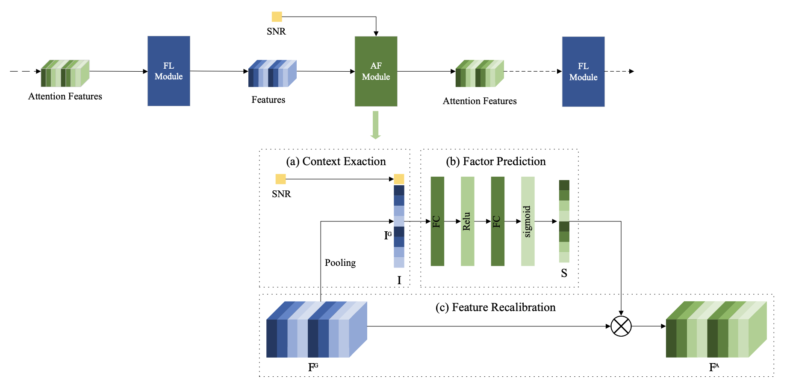

# Code: Wireless Image Transmission Using Deep Source Channel Coding with Attention Modules
Adaptive/Attention Deep Joint Source Channel Coding

# Datasets:
CIFAR-10 is from inner tensorflow.keras.datasets.cifar10.<br>
ImageNet is manually made and is too huge to upload.

# Warning:
1. The provided folder of tensorflow_compression is only for macOS. If you want to use tensorflow_compression in other systems, please use pip to install [tensorflow_compression](https://github.com/tensorflow/compression) and change corresponding codes reling on tensorflow_compression.
2. If you want to use ImageNet to test bdjscc_imagenet.py and adjscc_imagenet.py, you can use pip to install [tensorflow_dataset](https://www.tensorflow.org/datasets?hl=zh-cn) and download [ImageNet](https://www.tensorflow.org/datasets/catalog/imagenet2012?hl=zh-cn). The corrsponding code of loading ImageNet should be modified.

# Citation:
J. Xu, B. Ai, W. Chen, A. Yang, P. Sun and M. Rodrigues, "Wireless Image Transmission Using Deep Source Channel Coding With Attention Modules," in IEEE Transactions on Circuits and Systems for Video Technology, vol. 32, no. 4, pp. 2315-2328, April 2022, doi: 10.1109/TCSVT.2021.3082521.

If you have any question, please feel free to contact me via: xjl-88410@163.com


# Run the code 
### 运行adjscc_cifar10.py
查看 `adjscc_cifar10.py` 中 `if __name__ == "__main__":` 对于脚本的命令行参数的定义
```python
python adjscc_cifar10.py -h  
```
> `-h`：打印出脚本的用法说明、可接受的参数选项及它们的含义  
```python
python adjscc_cifar10.py trains -ct awgn  
```
> 至少需要指定脚本运行模式 trains/eval/eval_burst 和信道类型 -ct awgn/slow_fading/slow_fading_eq/burst
### 指定预训练模型路径
```python
python adjscc_cifar10.py train -ct <信道> --load_model_path <预训练模型路径> 
``` 
> 预训练模型路径的一般形式为/path/to/your/model.h5
### eval 评估模式
```python
python adjscc_cifar10.py eval -ct <信道> -wd <工作路径>
``` 
### 查看 Tensorboard 事件日志文件
```python
tensorboard --logdir=checkpoint/adjscc_imagenet-96-16ch-20250504_142143/board/ # 根据生成的日志文件路径修改
```